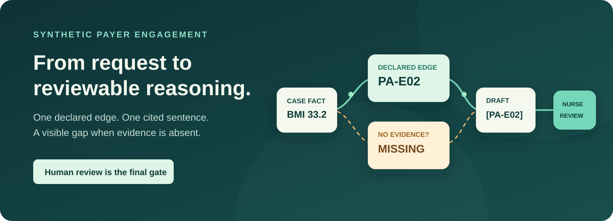
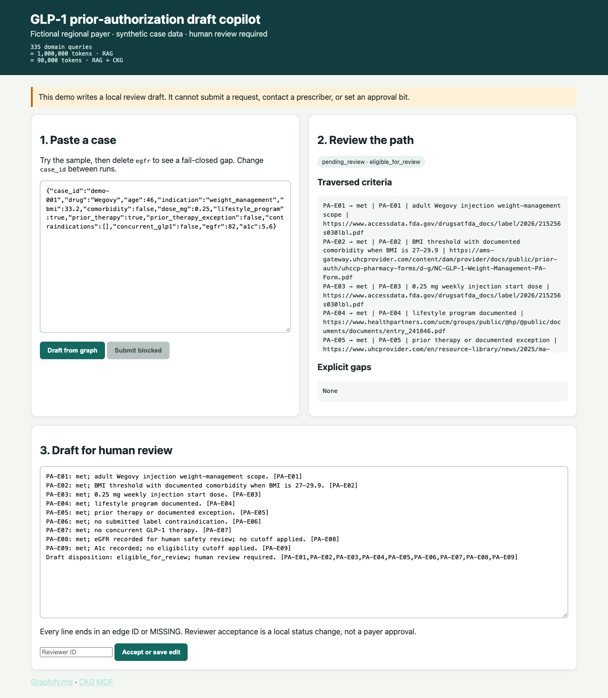

# GLP-1 prior-authorization draft gate

The runnable graph is a **hand-written synthetic policy overlay**, not the published `glp1-obesity` CKG, and `ckg-mcp` is not loaded here. This synthetic Forward Deployed Engineer engagement by Daniel Yarmoluk follows a nurse who receives a GLP-1 start request, checks declared criteria, and reviews a cited draft. Every line points to a returned edge or an explicit gap; the nurse remains the decision-maker.

[](https://github.com/Yarmoluk/glp1-pa-copilot/actions/workflows/ci.yml)
[](https://yarmoluk.github.io/glp1-pa-copilot/)
[](LICENSE)

[**Explore the interactive graph**](https://yarmoluk.github.io/glp1-pa-copilot/graph/) · [**Read the plain-language guide**](https://yarmoluk.github.io/glp1-pa-copilot/) · [**Run the demo**](https://yarmoluk.github.io/glp1-pa-copilot/run/)



## What am I looking at?

A prior-authorization request asks whether a treatment meets a plan's rules. A search engine can find a relevant paragraph; it cannot, by itself, show that *this* submitted case satisfied *that* exact criterion. Here, the criteria are declared as named graph edges. The app walks those edges, checks the submitted fields, and writes a draft whose sentences end in an edge ID or `MISSING`. The draft cannot be submitted to a payer.

The payer, policy overlay, and all 40 cases are **synthetic**. The runnable graph is only the hand-specified [illustrative policy fixture](data/synthetic-policy.json). The separate public [`ckg-mcp`](https://github.com/Yarmoluk/ckg-mcp) package informed the discovery map; this repo does not load or redistribute its `glp1-obesity` domain. No hosted MCP key or model API key is needed.

> **Public demo boundary:** This repository shows how a consumer can traverse a small declared edge list and draft with citations. It does **not** contain Graphify.md's CKG discovery, extraction, compression, source-hashing, or graph-construction process. [Read the scope statement](docs/scope.md).

## Clone and run in about 90 seconds

```bash
git clone https://github.com/Yarmoluk/glp1-pa-copilot.git
cd glp1-pa-copilot
python3 -m venv .venv
. .venv/bin/activate
python -m pip install -e '.[test]'
uvicorn pa_copilot.api:app --host 127.0.0.1 --port 8000
```

Open **http://127.0.0.1:8000** and click **Draft from graph**. The prefilled synthetic case is the happy path. For the fail-closed path, click **Missing lab**, then draft again. The result becomes `needs_information` with gap `PA-E08`. Submit stays blocked in both paths. The [guided walkthrough](https://yarmoluk.github.io/glp1-pa-copilot/run/) includes an out-of-graph case and reviewer edit.



## What to inspect

| If you care about… | Open… |
|---|---|
| The decision path | [Interactive graph](https://yarmoluk.github.io/glp1-pa-copilot/graph/) and [`core.py`](src/pa_copilot/core.py) |
| What the agent may do | [Action boundary](docs/action-boundary.md) and [`api.py`](src/pa_copilot/api.py) |
| Source-to-edge mapping | [Discovery note](docs/discovery.md) and [synthetic policy](data/synthetic-policy.json) |
| Evaluation design | [Evaluation guide](https://yarmoluk.github.io/glp1-pa-copilot/evaluation/), [cases](eval/cases.json), and [`eval.py`](src/pa_copilot/eval.py) |
| Customer ownership | [Handoff](docs/handoff.md) and [shadow-week plan](docs/shadow-week.md) |
| Public vs private boundary | [What this demo shows](docs/scope.md) |

## Frozen synthetic evaluation

Run `pytest -q`, `python -m pa_copilot.eval`, and `python -m pa_copilot.verbalizer_eval`. The frozen test split has 20 of 40 synthetic cases.

| Result | Frozen test split |
|---|---:|
| Invalid-action count | **0** |
| Abstention on out-of-graph asks | **100% (3/3)** |
| Citation coverage | **100%** |
| Criterion precision / recall | **1.00 / 1.00** |

The criterion labels were written against this same nine-edge fixture. Their score shows this gate did not drift on its fixture; it does not show generalization. [Definitions, token proxy, and limits](https://yarmoluk.github.io/glp1-pa-copilot/evaluation/).

The default renderer ID is `rule-walk-v1`. It walks declared rules and makes no model call. Review status stays `pending_review` until a named reviewer accepts or edits the draft, with a diff written to local append-only JSONL. There is no approval bit, payer submission endpoint, or prescriber message action. This is not production software or a certification claim.

### Optional verbalizer: the draft copilot boundary

After the rule walk returns criterion outcomes and edge IDs, a verbalizer may put that path into words. `VERBALIZER=stub` runs the faithful local stub; `VERBALIZER=stub-hostile` appends a fabricated edge and the API rejects its draft. `VERBALIZER=live` uses an optional provider when `OPENAI_API_KEY` is set; without a key it runs the faithful stub. Install `pip install -e '.[live]'` only to try the live path. The model may change wording, but cannot add an edge, change an outcome, or bypass human review. CI runs the keyless stub and the four separate [verbalizer cases](eval/verbalizer_cases.json), including the hostile rejection.

## Build the documentation

```bash
python -m pip install -r requirements-docs.txt
python scripts/sync_demo_visual.py --check
mkdocs serve
```

Open **http://127.0.0.1:8000/glp1-pa-copilot/** for the docs server (use a different port if the app is running). CI runs `mkdocs build --strict` and publishes the docs after tests and evaluation pass.

<details><summary>Published CKG benchmark context — separate from this demo</summary>

Graphify.md's [v0.6.2 paper](https://github.com/Yarmoluk/ckg-benchmark/blob/main/paper/main.pdf) and [harness](https://github.com/Yarmoluk/ckg-benchmark) report Macro-F1 **0.471 vs RAG 0.123**, 5-hop F1 **0.772**, and roughly **269 vs 2,982 tokens/query** on a structural-query benchmark. Those are not results from this prior-authorization app and cannot be transferred to payer cases.

```text
335 domain queries
= 1,000,000 tokens · RAG
= 90,000 tokens · RAG + CKG
```

The context-window illustration is product positioning, not measured in this repo. Graphify.md provides a model-agnostic [MCP endpoint](https://www.graphifymd.com/api/mcp) with `query_ckg`, `get_prerequisites`, `traverse`, and `validate_ckg`; this clone uses a local adapter so a reviewer can run it without credentials.

</details>
