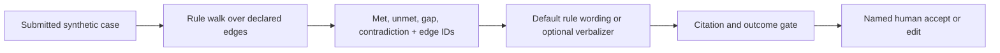

# How the draft gate works

## Walk, optional verbalize, human review

The service loads **only a synthetic policy fixture**. The separate public `glp1-obesity` domain informed the discovery map, but it is not loaded or redistributed here. The fixture names the nine illustrative criteria the demo checks, from scope and BMI to dose, prior therapy, safety flags, and documentation fields. Each edge has a stable ID and a public source-pattern link. This consumer-side code does not create a CKG from documents.

For each case, a deterministic breadth-first traversal returns the reachable policy edges. The evaluator checks only those edges against submitted fields. If an edge is absent, a field is missing, the input contradicts itself, or a request has no matching edge, it emits a gap. The default renderer ID is `rule-walk-v1`: **no model call is made**. Its outputs are the source of truth.

The optional verbalizer receives only those result objects. The local faithful stub (`verbalizer-stub-v1`) is CI's keyless default. The hostile stub deliberately adds `PA-E999`; the citation gate rejects the whole case. `VERBALIZER=live` uses `verbalizer-live` only when an API key is present, otherwise it falls back to the faithful stub. The gate checks line count and order, criterion outcomes, returned edge IDs, and the final disposition. The model is **not allowed to add an edge** or change a `missing` contradiction into `met`. These checks constrain structure and citations; a human still reviews the wording.

## Follow one criterion

| Item | Value in the happy path |
|---|---|
| Submitted fact | BMI `33.2` |
| Declared policy relationship | `PA-E02`: adult weight-management request requires the BMI criterion |
| Deterministic result | `met` |
| Draft excerpt | `PA-E02: met; BMI threshold ... [PA-E02]` |
| Final action | Draft remains `pending_review` |

A source URL attached to an edge makes the rule inspectable; it does **not** make a fictional policy legally applicable or clinically current. A customer engineer would need a signed policy version and policy-owner attestation before using this pattern in a real workflow.

## Where the model cannot act

The code exposes `/cases/draft`, `/cases/{case_id}`, and `/cases/{case_id}/review`. It has **no submit endpoint** and no approval bit. A named reviewer may accept or edit a draft locally; the service logs the diff. Every rendered draft line ends in a returned edge ID or `MISSING`. The model cannot submit, message a prescriber, infer a diagnosis, or insert policy evidence. The [action boundary](action-boundary.md) also explains why appeal filing, peer-to-peer scheduling, and diagnosis inference are outside scope.

## What is here, and what a real deployment needs

| In this repo | Needed for a real payer deployment |
|---|---|
| Synthetic policy overlay, source-pattern URLs | Signed, current plan policy and clinical/policy-owner review |
| Synthetic case JSON | Authorized intake, identity, access, PHI controls |
| Local append-only JSONL | Durable audit storage, retention, access control, tamper evidence |
| Local reviewer ID | Authenticated reviewer identity and separation of duties |
| Frozen synthetic evaluation | Shadow-week measurement on approved cases and independent human scoring |

[Read the architecture decision](adr-001-graph-not-rag.md) or [change a criterion safely](handoff.md).
